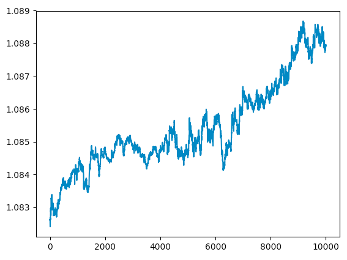

# Foreign Exchange Trading

`input.txt` is currency exchange rate between two contry in eight hours. Run `python3 visual.py` to visualize the data.  
  

## Prediction
Run `python3 guess.py` to see the prediction result.  
First thing first, I create an _observed sequence_ which takes the difference between adjacency datas in raw data sequence.  
And mapping each members of _observed sequence_ to discrete interger representing the observed variable's id.  
I define `EPS = 0.00001` and 5 observed variable:
```
0: within +-EPS
1: < -EPS
2: < -3 * EPS
3: > EPS
4: > 3 * EPS
```
The model which is the closest to real world is unknown. The only thing I know is the observed sequence.  
Guessing there are 6 hidden variable, using previous 10 observed sequence to train a random generated model. Using this model and the 10 observed sequence again to predict next observed sequence. Because I have no idea the meaning of each hidden variable, I can just predict the probability of each observation in next time step.  
